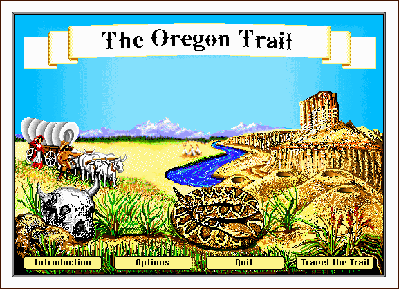
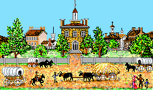
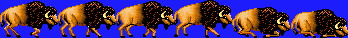
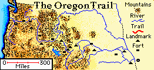
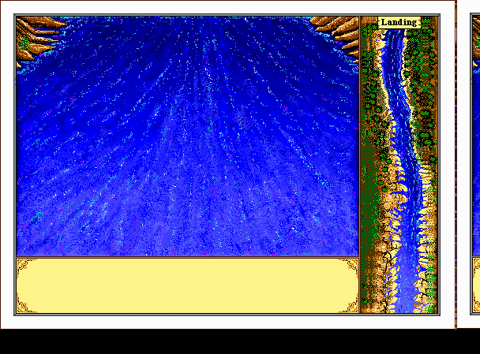
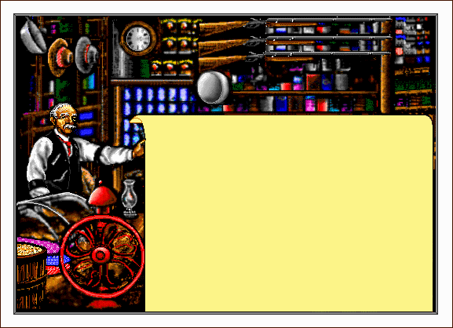

# Oregon Trail Decompiler

[](https://kenerwin88.github.io/oregon-trail-deluxe-decompiler/)

A comprehensive toolset for extracting and converting assets from the 1990 DOS version of The Oregon Trail to modern formats. This project aims to make the game's assets accessible for preservation, study, and potential modern reimplementations.

<div align="center">
  
</div>

## Documentation Website

**[🌐 EXPLORE THE OREGON TRAIL ASSETS ONLINE](https://kenerwin88.github.io/oregon-trail-deluxe-decompiler/)**

Visit our documentation website to explore the extracted assets and learn about the file formats used in the original game. The website provides:

- Visual galleries of all extracted images
- Playable sound and music files
- Detailed explanations of the proprietary file formats
- Technical insights into the game's architecture

## Extracted Assets Preview

<div align="center">
  <table>
    <tr>
      <td align="center"><br><em>Starting Location</em></td>
      <td align="center"><br><em>Buffalo for Hunting</em></td>
    </tr>
    <tr>
      <td align="center"><br><em>Trail Map</em></td>
      <td align="center"><br><em>Wagon Train</em></td>
    </tr>
  </table>
</div>

## Quick Start
```bash
# Extract and convert everything with a single command
python3 main.py
```
This will:
1. Clean any existing output directories
2. Extract all files from OREGON.GXL to raw_extracted/
3. Convert all game files to modern formats in modern/

## Features

- **Asset Extraction**: Extract files from OREGON.GXL and process standalone game files
- **Format Conversion**: Convert original game assets to modern formats:
  - Images: PC8/PC4/PCX → PNG
  - Music: XMI → MIDI
  - Sound: Raw PCM → WAV
  - Text: CTR → UTF-8
  - Animations: ANI → Modern format
  - High Scores: LST → JSON
  - Controls: CTR → JSON
  - Fonts: GFT → Modern format

- **Technical Documentation**: Detailed analysis of original file formats
- **Automated Pipeline**: Single command to extract and convert all assets

## Project Structure

<div align="center">
  
  <p><em>The project provides tools to extract and convert all game assets</em></p>
</div>

```
original_game/      # Original DOS game files
  OREGON.EXE        # Main game executable
  OREGON.GXL        # Game asset archive
  *.COM, *.ADV      # DOS drivers and support files

raw_extracted/      # Extracted original assets (from GXL)

docs/modern/        # Converted modern assets
  images/           # Converted PNG images
  music/            # Converted MIDI files
  sounds/           # Converted WAV files
  text/             # Converted text files
  animations/       # Converted animations
  controls/         # Converted control files
  scores/           # Converted high scores
  fonts/            # Converted fonts

tools/              # Asset conversion tools
  convert.py        # Main conversion script
  convert_*.py      # Format-specific converters

docs/               # Technical documentation
  
tests/              # Test cases
```

## Usage

### Quick Start
```bash
# Extract and convert everything in one step
python3 main.py
```
This will:
1. Clean any existing raw_extracted/ and modern/ directories
2. Extract all files from OREGON.GXL to raw_extracted/
3. Convert all game files (both extracted and standalone) to modern formats in modern/

### Advanced Usage

#### Extract Game Assets
```bash
# Extract files from GXL archive
python3 main.py extract original_game/OREGON.GXL --output raw_extracted

# Analyze GXL without extracting
python3 main.py extract original_game/OREGON.GXL --analyze

# Output analysis in JSON format
python3 main.py extract original_game/OREGON.GXL --analyze --format json
```

#### Convert to Modern Formats
```bash
# Convert all files from a directory
python3 main.py convert raw_extracted --output modern

# Convert specific file types
python3 main.py convert raw_extracted --output modern --type pc8  # PC8/PCX images
python3 main.py convert raw_extracted --output modern --type xmi  # Music files
python3 main.py convert raw_extracted --output modern --type snd  # Sound files
python3 main.py convert raw_extracted --output modern --type text # Text files
python3 main.py convert raw_extracted --output modern --type ani  # Animations
python3 main.py convert raw_extracted --output modern --type ctr  # Controls
python3 main.py convert raw_extracted --output modern --type lst  # High scores

# Enable debug logging
python3 main.py convert raw_extracted --output modern --debug
```

### Run Original Game
```bash
dosbox-x -conf dosbox-x.conf
```

### Output Structure
After running the converter, you'll find:
- `raw_extracted/`: Files extracted from OREGON.GXL
- `docs/modern/`: All game assets converted to modern formats:
  - `images/`: PNG images from PC8/PC4/PCX files
  - `music/`: MIDI files from XMI
  - `sounds/`: WAV files from raw PCM
  - `text/`: UTF-8 text files
  - `animations/`: Converted animations
  - `controls/`: Control settings and layouts
  - `scores/`: High score data
  - `fonts/`: Converted fonts

The assets are placed directly in the `docs/modern/` directory to make them ready for GitHub Pages deployment.

## File Format Documentation

<div align="center">
  
  <p><em>The game uses multiple proprietary file formats for graphics, sound, and game data</em></p>
</div>

See [docs/](docs/) for detailed technical analysis of the original game's file formats:

- [executable_analysis.md](docs/executable_analysis.md): Analysis of OREGON.EXE
- [ctr_format_analysis.md](docs/ctr_format_analysis.md): Control file format
- [XMI_format.md](XMI_format.md): Music file format

<div align="center">
  <table>
    <tr>
      <td><strong>Format</strong></td>
      <td><strong>Description</strong></td>
      <td><strong>Modern Equivalent</strong></td>
    </tr>
    <tr>
      <td>PC8/PC4</td>
      <td>256/16-color images with RLE compression</td>
      <td>PNG</td>
    </tr>
    <tr>
      <td>XMI</td>
      <td>MIDI music with custom headers</td>
      <td>MIDI</td>
    </tr>
    <tr>
      <td>SND</td>
      <td>Raw PCM audio data</td>
      <td>WAV</td>
    </tr>
    <tr>
      <td>CTR</td>
      <td>Control files for UI and game logic</td>
      <td>JSON</td>
    </tr>
    <tr>
      <td>ANI</td>
      <td>Animation sequences</td>
      <td>PNG sequences</td>
    </tr>
  </table>
</div>

## Contributing
If you worked on the original game, please reach out to me so that I can get your autograph (serious). :D

## License

This project is for educational and preservation purposes only. The Oregon Trail is a registered trademark of The Learning Company.
