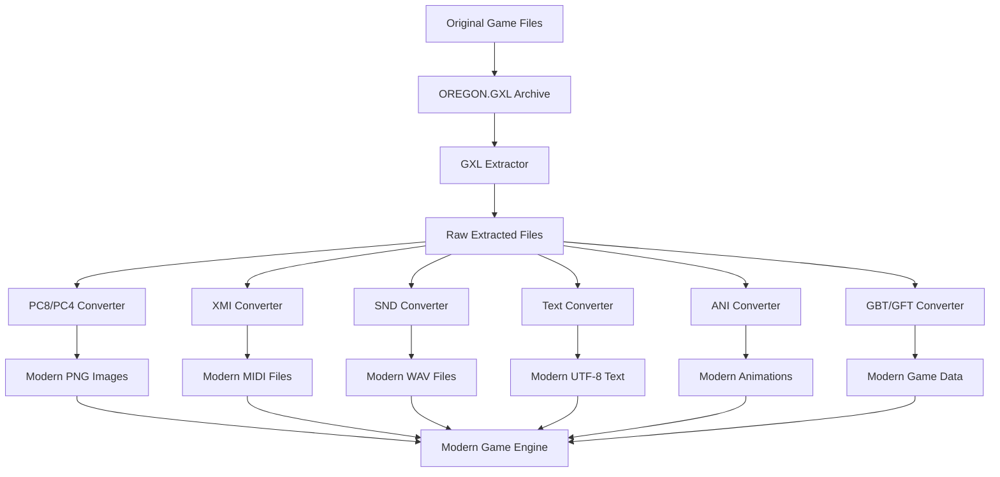
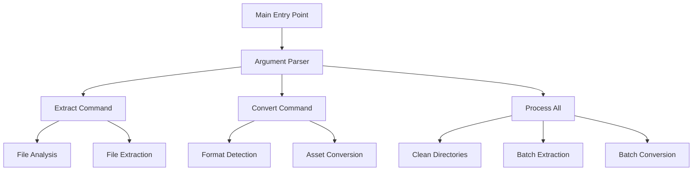
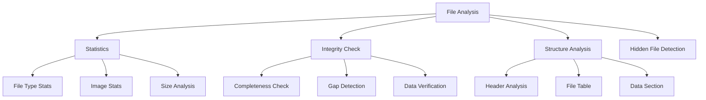
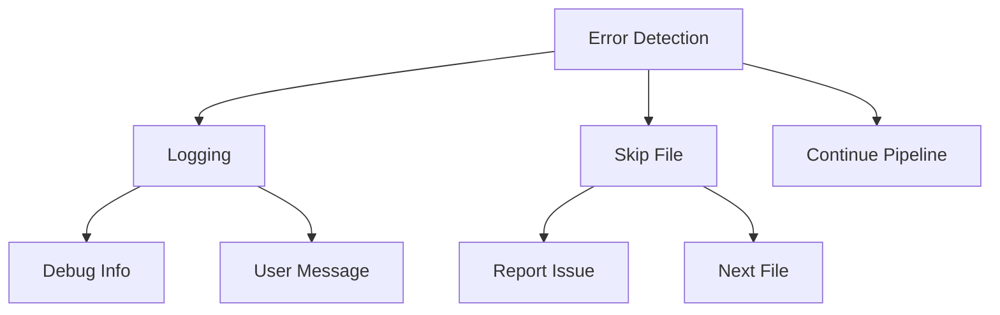

# System Patterns: Oregon Trail Decompilation

## Architecture Overview

The project follows a modular architecture with clear separation of concerns:



## Core Design Patterns

### 1. Command Line Interface

The system implements a comprehensive CLI architecture:



Key Features:
- Subcommand structure (extract, convert)
- Common parameter patterns
- Debug mode support
- Format-specific options
- Analysis capabilities
- Integrity verification

### 2. Pipeline Processing

The system implements a clean pipeline pattern for asset conversion:
1. **Extraction**: Raw assets extracted from GXL archive
   - File integrity verification
   - Hidden file detection
   - Statistical analysis
2. **Format Conversion**: Format-specific converters transform assets to modern formats
3. **Consumption**: Modern game engine consumes converted assets

### 3. Analysis System

Comprehensive file analysis capabilities:


### 4. Modular Converter Architecture

Each converter follows a consistent pattern:
- Standalone operation with CLI interface
- Integration with the main conversion pipeline
- Format-specific parsing and transformation logic
- Debug logging capabilities

```python
def convert_X(input_path, output_path) -> bool:
    """
    Convert files of format X to modern formats
    
    Returns True if file was converted, False if skipped
    """
```

### 5. Error Handling Pattern

Structured approach to error management:


### 6. File Type Detection

File format detection uses a combination of:
- File extension analysis
- Header signature checking (for binary formats)
- Extension-based routing to appropriate converters
- Format validation

### 7. Asset Management

Assets are organized in a structured directory hierarchy:

```
/
├── original_game/     # Original DOS game files
│   ├── OREGON.EXE     # Game executable
│   ├── OREGON.GXL     # Asset archive
│   └── ...            # Support files
│
├── raw_extracted/     # Extracted original assets
│   ├── *.PC8, *.PC4   # Original images
│   ├── *.XMI          # Original music
│   ├── *.SND          # Original sounds
│   └── ...            # Other asset files
│
├── modern/            # Converted modern assets
│   ├── images/        # Converted PNG images
│   ├── music/         # Converted MIDI files
│   ├── sounds/        # Converted WAV files
│   ├── text/          # Converted text files
│   ├── animations/    # Converted animations
│   └── fonts/         # Converted font assets
```

## File Format Specifications

### PC8/PC4 (Image) Format

- PCX-based format with custom palette handling
- 8-bit (PC8) or 4-bit (PC4) color depth
- RLE compression for scan lines
- 16-color palette in header (PC4) or 256-color palette at end (PC8)

### XMI (Music) Format

- Miles Sound System proprietary format
- MIDI-like with custom chunking (FORM/CAT/TIMB/EVNT)
- 60 PPQN timing
- Duration-embedded note events
- 7-bit delay sums

### SND (Sound) Format

- Raw 8-bit unsigned PCM audio
- No header information
- 11025 Hz sample rate (standard PC speaker rate)

### CTR/TXT (Text) Format

- ASCII-encoded text files
- Simple structure with minimal formatting
- Dialog, interface text, and game information

### ANI (Animation) Format

- Custom animation format
- Frame-based sprite animations
- May include transparency

### GBT/GFT (Game Data) Format

- Game-specific structured data formats
- Static game information (GBT)
- Font definition data (GFT)
